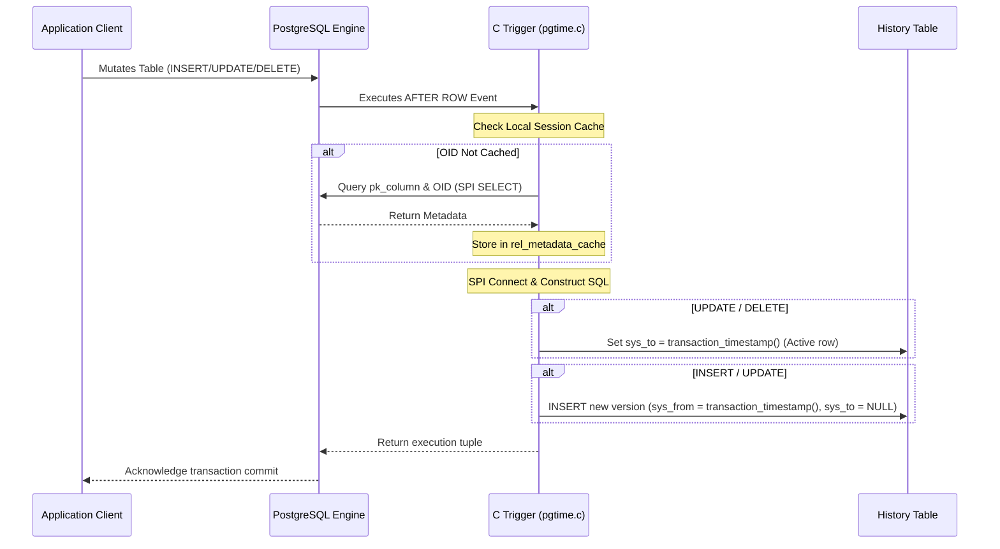

# pgtime Architecture & Internals

This document provides a deep-dive into the design, transactional mechanics, concurrency model, indexing strategy, and competitive differentiation of `pgtime`.

---

## 1. Core Trigger Lifecycle & SPI

`pgtime` hooks into PostgreSQL using an `AFTER ROW` C-trigger function (`pgtime_trigger_fn()`) registered for `INSERT`, `UPDATE`, and `DELETE` events. 



### Execution Steps
1. **DML Interception:** When a write query changes a row, PostgreSQL fires our trigger *after* the row operation completes.
2. **Metadata Introspection (Session Cached):** 
   * The trigger retrieves the primary key column name and OID for the relation.
   * To prevent high query latency, we cache this metadata in a static session array (`rel_metadata_cache`) matching the relation `Oid`. 
   * Subsequent updates on the same table bypass the metadata catalog lookup entirely.
3. **SPI Connection:** The trigger connects to the SPI (Server Programming Interface) manager and dynamically formats the history writes.
4. **Operation Branching:**
   * **On DELETE:** Updates the active history row (`sys_to IS NULL`) matching the primary key, sets `sys_to = transaction_timestamp()`, and sets `_pgtime_op = 'D'`.
   * **On UPDATE:** Updates the active history row to set `sys_to = transaction_timestamp()`. It then inserts a new version containing the new column values, `sys_from = transaction_timestamp()`, `sys_to = NULL`, and `_pgtime_op = 'U'`.
   * **On INSERT:** Inserts a new history record with the column values, `sys_from = transaction_timestamp()`, `sys_to = NULL`, and `_pgtime_op = 'I'`.

---

## 2. Transaction Integrity & Rollback Behavior

`pgtime` guarantees **absolute consistency** by operating entirely within the parent transaction context.

* **Single Transaction Context:** All history updates are executed synchronously using the caller's connection and transaction scope.
* **Rollback Safety:** If the parent transaction fails (either due to a constraint violation, database error, or manual `ROLLBACK`), PostgreSQL automatically aborts and rolls back all writes made by the C trigger. No orphaned, uncommitted, or dirty history entries are ever written.
* **Timestamp Consistency:** We use PostgreSQL's `transaction_timestamp()` rather than `clock_timestamp()` or client-side `now()`. This ensures that if a single transaction inserts or updates multiple related records, all of them receive the *exact same* historical transaction bounds (`sys_from` / `sys_to`), enabling consistent multi-row snapshot reconstructions.

---

## 3. Concurrency & Locking Behavior

Under heavy write-concurrency, `pgtime` manages locks defensively:

* **Active Row Updates:** On `UPDATE` or `DELETE`, pgtime locates the active version via `sys_to IS NULL`. Under standard `READ COMMITTED` isolation, if two concurrent transactions update the same row, the second transaction blocks until the first commits. Once the first commits, the second executes the trigger, closing the newly updated record and creating its own active version.
* **No Table Locks:** History writes use fine-grained row locks on the history table. No exclusive table-level locks are acquired, ensuring high throughput.
* **Index Contention:** GiST range indexes can occasionally experience lock contention under extremely high write frequencies (e.g., >5,000 updates/second). If write performance is paramount, consider configuring index-fillfactors.

---

## 4. MVCC & Indexing Strategy

Temporal querying requires efficient filtering of overlapping datetime intervals. We configure two distinct indexes for every attached table:

1. **GiST Range Index:** 
   * Syntax: `CREATE INDEX ... ON history_table USING GIST (tstzrange(sys_from, sys_to));`
   * Purpose: Supports logarithmic time complexity ($O(\log N)$) snapshot lookups. Range searches check if the target timestamp falls within the bounds of `tstzrange(sys_from, sys_to)`.
2. **Partial BTree Index:**
   * Syntax: `CREATE INDEX ... ON history_table (pk_column) WHERE sys_to IS NULL;`
   * Purpose: Accelerates write paths. Before writing an `UPDATE` or `DELETE`, the trigger must locate the currently active version. Indexing only active rows (`sys_to IS NULL`) ensures this lookup is extremely fast and index size remains small.

---

## 5. Storage Overhead & Archiving

Because `pgtime` records every update and deletion, storage requirements grow linearly with mutation rates ($O(\text{writes})$).

* **Storage Calculations:** Each `UPDATE` adds 1 new row to the history table. A `DELETE` updates the active row in place without inserting new rows.
* **Data Growth:** Unbounded history tables can bloat and impact range scan performance over time.
* **Archiving Strategy:** In `v0.2`, we plan to release an archiving framework where versions older than a retention threshold (e.g., 90 days) can be automatically partitioned out or exported to cold storage.

---

## 6. Schema Evolution Handling

If you perform `ALTER TABLE` on a tracked parent table, the extension requires catalog synchronization:

1. **The Gotcha:** Modifying columns (adding, removing, or changing data types) on the parent table does not automatically propagate to the `<table_name>_history` table.
2. **Standard Upgrade Sequence:**
   * Detach tracking: `SELECT pgtime.detach('orders');`
   * Execute schema changes on both tables:
     ```sql
     ALTER TABLE orders ADD COLUMN status TEXT;
     ALTER TABLE orders_history ADD COLUMN status TEXT;
     ```
   * Re-attach tracking: `SELECT pgtime.attach('orders');`

---

## 7. Competitive Differentiation

| Feature | `pgtime` | pgAudit | Logical Replication / CDC | PL/pgSQL Audit Triggers |
| :--- | :--- | :--- | :--- | :--- |
| **Primary Goal** | Application-queryable Point-in-Time snapshots | Compliance security auditing (syslog/stderr) | Offloading data to search/analytical engines | Row-level data tracking |
| **Write Speed** | Fast (Compiled C Trigger) | N/A (writes to log stream) | Async overhead | Slow (interprative context switch) |
| **Query Ergonomics** | Native view helpers (`orders_as_of()`) | Unreadable via SQL (logs are external) | Requires separate database instance | Complex SQL query syntax |
| **Transactional?** | Yes (synchronous) | No (write-only logs) | No (eventually consistent) | Yes |
| **Infrastructure Cost** | Zero (fully inside database) | Minimal | High (requires Kafka, Debezium, etc.) | Zero |
